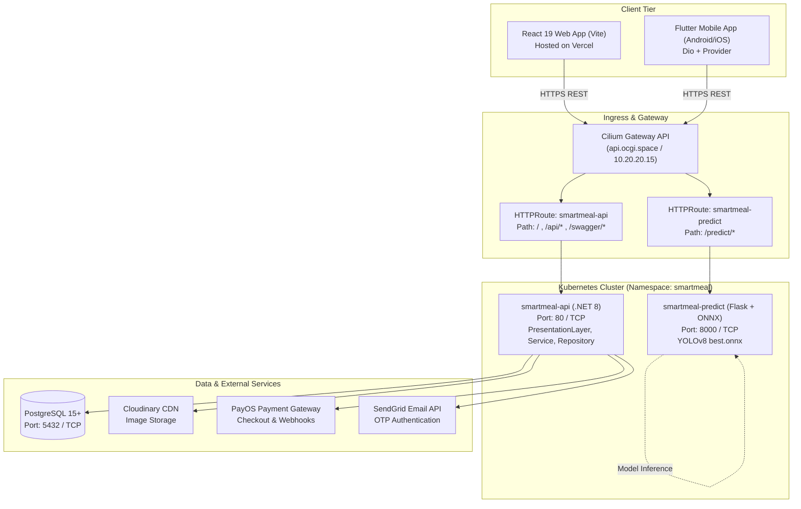
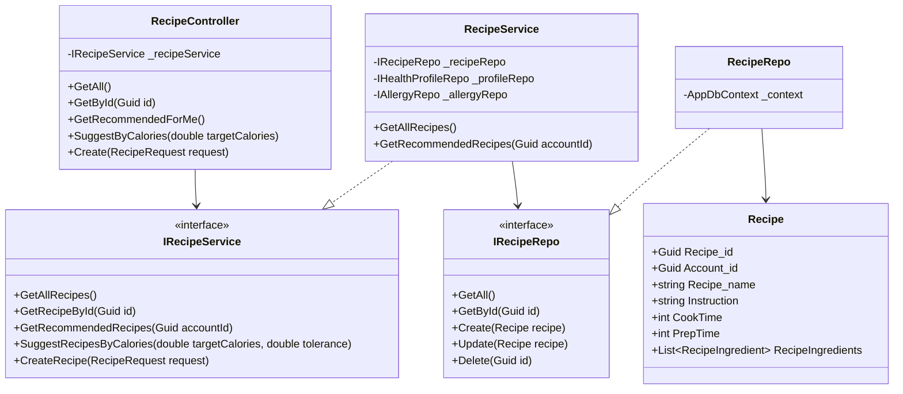
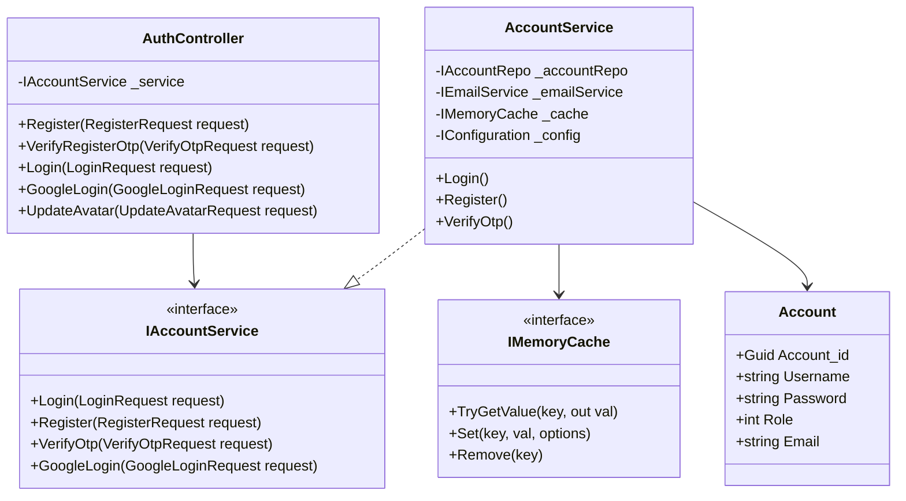
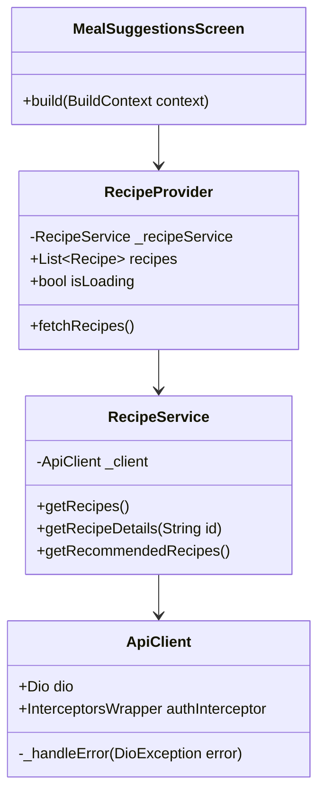
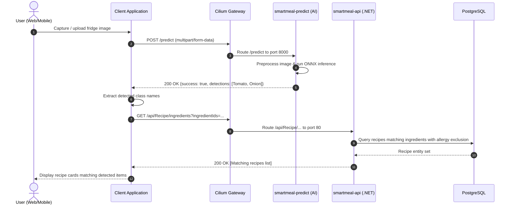
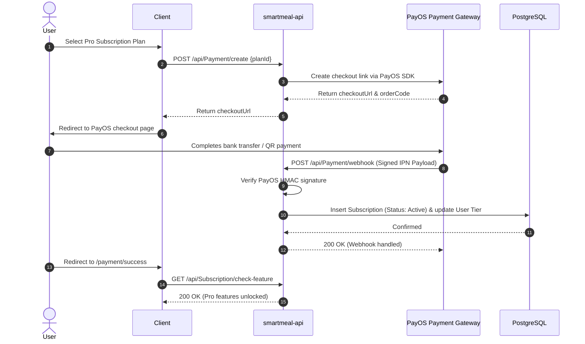
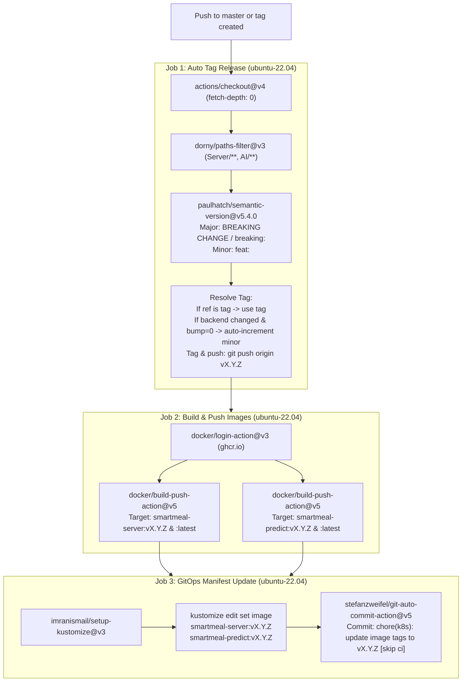

# SmartMeal Architecture & System Design Documentation

This document describes the architectural topology, deployment configuration, core module structures, cross-service communication flows, and CI/CD lifecycle of the **SmartMeal** platform.

---

## 1. System Topology Overview

SmartMeal is an intelligent meal recommendation and dietary tracking platform comprising a **.NET 8 Clean Architecture** backend, a **Python / Flask / ONNX Runtime** AI computer vision engine, a **React 19 / Vite** single-page web app, and a **Flutter (Dart 3)** cross-platform mobile application.



---

## 2. Infrastructure & Deployment Architecture

### 2.1 Kubernetes Gateway API & Routing
SmartMeal uses Kubernetes **Gateway API** with Cilium CNI and MetalLB load balancing in production:
- **Namespace**: `smartmeal`
- **Gateway**: `shared-gateway` (`gatewayClassName: cilium`, IP: `10.20.20.15`)
- **Host**: `api.ocgi.space`

#### HTTPRoute Rules:
```mermaid
flowchart LR
    Request["Incoming Request: api.ocgi.space"]
    GW["Gateway: shared-gateway"]
    MatchPrefix{"Path Match"}
    BackendApi["Service: smartmeal-api:80"]
    BackendPredict["Service: smartmeal-predict:8000"]

    Request --> GW --> MatchPrefix
    MatchPrefix -->|"/", "/api/*", "/swagger/*"| BackendApi
    MatchPrefix -->|"/predict/*"| BackendPredict
```

### 2.2 Kubernetes Network Policies
Zero-trust network security is enforced in `infra/k8s/overlay/prod/network-policy.yaml`:
- **Default Deny All**: `smartmeal-default-deny-all` blocks all ingress and egress by default across the namespace.
- **smartmeal-api-netpol**:
  - Ingress: Port 80 (TCP) from Gateway/Ingress.
  - Egress: Port 53 (UDP/TCP) to `kube-dns`, Port 5432 (TCP) to PostgreSQL, Port 443 (TCP) for HTTPS external outbound (PayOS, SendGrid, Cloudinary).
- **smartmeal-predict-netpol**:
  - Ingress: Port 8000 (TCP) from Gateway.
  - Egress: Port 53 (UDP/TCP) to `kube-dns` only (fully isolated; no external internet access).

---

## 3. Backend Module Class Diagrams (Clean Architecture)

SmartMeal adheres to Clean Architecture with four distinct project layers:
1. **BusinessObject**: Core entities, data annotations, and DTO request/response models.
2. **DataAccessLayer**: `AppDbContext`, EF Core migrations, and model binding.
3. **Repository**: Data access abstractions (`IRecipeRepo`, `IPlanRepo`, etc.) and implementations using EF Core.
4. **Service**: Domain business logic, caching, external SDKs (`IRecipeService`, `IMealPlanningService`, etc.).
5. **PresentationLayer**: ASP.NET Core Web API Controllers, Background Services, and Swagger UI.

### 3.1 Recipe & Nutrition Module



### 3.2 Authentication & User Lifecycle Module



---

## 4. Frontend & Mobile Client Architecture

### 4.1 React Web Client (`Client/src`)
- **State & Networking**: Axios instance with request/response interceptors (`src/services/api.js`).
- **Feature Structure**:
  - `src/pages/MealDetail`: Recipe rendering and portion breakdown.
  - `src/pages/ingredient-detection`: Image upload and direct canvas rendering of ONNX bounding boxes.
  - `src/pages/admin`: User management, subscription stats, and content moderation.
  - `src/hooks/useActivityTracker.js`: Sends heartbeat telemetry every 30s to `/api/Activity/heartbeat` and monitors first-recipe interaction.

### 4.2 Flutter Mobile Client (`ClientMobile/lib`)
- **Architecture**: Clean Architecture / Feature-Driven Design:
  - `core/network/api_client.dart`: Singleton `Dio` instance with Bearer JWT interceptors and error mappings.
  - `core/constants/api_constants.dart`: Centralized endpoint catalog with platform-aware IP resolution (Web, Android Emulator, Real Device).
  - `features/{auth,recipes,diary,meal_plan,onboarding,profile}/`: Domain entities, data sources, and Provider state management.



---

## 5. Sequence & Communication Flows

### 5.1 AI Ingredient Detection & Recipe Recommendation Flow



### 5.2 Subscription Checkout & Webhook Lifecycle



---

## 6. CI/CD Lifecycle & Conventional Commits

The deployment automation defined in `.github/workflows/main.yml` coordinates semantic versioning, multi-container builds, and GitOps manifest updates:



### Conventional Commit Specifications:
- `feat:`: Increments **Minor** version (e.g. `v1.1.0` $\rightarrow$ `v1.2.0`).
- `fix:` / `perf:` / `refactor:`: Increments **Patch** version.
- `BREAKING CHANGE:` / `breaking:`: Increments **Major** version.
- If backend changes are present in `Server/` or `AI/` without explicit prefix bumping, the workflow automatically increments the minor version to ensure image builds always receive unique release tags.
