# SmartMeal Database Architecture & Entity Design

This document details the database schema, entity specifications, relationships, persistence architecture, and migration timeline for the **SmartMeal** system.

---

## 1. Overview & Persistence Architecture

SmartMeal uses **PostgreSQL** as its primary relational database management system, managed via **Entity Framework Core 8** (`Npgsql.EntityFrameworkCore.PostgreSQL` provider) following Clean Architecture principles.

### Key Architectural Characteristics
- **Database Engine**: PostgreSQL 15+ (Production cluster connects to managed/internal PostgreSQL on port 5432).
- **ORM**: Microsoft Entity Framework Core 8.0.11.
- **Key Strategy**: `Guid` (UUID v4) primary keys generated client-side or database-side (`Guid.NewGuid()`), providing collision-free distributed identity.
- **Temporal Tracking**: `timestamp with time zone` (`timestamptz`) for all UTC audit timestamps (`CreatedAt`, `UpdatedAt`, `StartDate`, `EndDate`, `DiagnosedAt`).
- **Soft Deletion**: Standard `IsDeleted` boolean flag across domain tables to maintain referential integrity without destructive cascades.
- **Caching Layer**: In-memory caching via ASP.NET Core `IMemoryCache` for transient authentication states (OTP verification codes, pending registration payloads) with automatic absolute expirations.

---

## 2. Entity-Relationship Model (Mermaid Diagram)

```mermaid
erDiagram
    Account ||--o{ BmiLog : "records"
    Account ||--o{ Collection : "owns"
    Account ||--o{ GroceryLists : "creates"
    Account ||--o{ HealthProfile : "has"
    Account ||--o{ NutritionGoal : "sets"
    Account ||--o{ Recipe : "authors"
    Account ||--o{ UserDietPlan : "assigned"
    Account ||--o{ Allergies : "suffers"
    Account ||--o{ Pantries : "stocks"
    Account ||--o{ UserCondition : "diagnosed"
    Account ||--o{ Subscription : "subscribes"
    Account ||--o{ NutritionLog : "logs"
    Account ||--o{ SavedRecipe : "saves"
    Account ||--o{ MealPlan : "generates"
    Account ||--o{ UserSessionLog : "activity"

    Plan ||--o{ Subscription : "tier for"

    DietPlan ||--o{ UserDietPlan : "specifies"
    DietPlan ||--o{ ConditionDietRecommendation : "recommended for"

    MedicalCondition ||--o{ ConditionDietRecommendation : "triggers"
    MedicalCondition ||--o{ UserCondition : "diagnosed in"

    Ingredients ||--o{ Allergies : "causes"
    Ingredients ||--o{ NutritionalValues : "defines (1:1)"
    Ingredients ||--o{ Pantries : "stored as"
    Ingredients ||--o{ IngredientLabels : "tagged with"
    Ingredients ||--o{ AffiliateProducts : "sold via"
    Ingredients ||--o{ RecipeIngredients : "ingredient of"
    Ingredients ||--o{ NutritionLog : "consumed in"
    Ingredients ||--o{ GroceryItems : "item in"

    IngredientTags ||--o{ IngredientLabels : "classifies"
    Partners ||--o{ AffiliateProducts : "fulfills"

    Recipe ||--o{ RecipeIngredients : "contains"
    Recipe ||--o{ RecipeLabel : "classified by"
    Recipe ||--o{ SavedRecipe : "bookmarked in"
    Recipe ||--o{ NutritionLog : "consumed as"
    Recipe ||--o{ MealPlanEntry : "scheduled in"
    Recipe ||--o{ UserSessionLog : "first selected"

    Recipe_tag ||--o{ RecipeLabel : "associates"
    Collection ||--o{ SavedRecipe : "contains"

    GroceryLists ||--o{ GroceryItems : "comprises"
    AffiliateProducts ||--o{ GroceryItems : "linked product"

    MealPlan ||--o{ MealPlanDay : "composed of"
    MealPlanDay ||--o{ MealPlanEntry : "has slots"
```



---

## 3. Table Catalog & Column Schemas

### 3.1 Authentication, Users & Analytics

#### `Account`
Stores user profile, credentials, and global system roles.

| Column | Type | Nullable | Description |
|---|---|---|---|
| `Account_id` | `uuid` | NO | Primary Key |
| `Role` | `integer` | NO | Role enum (`0`: User/Customer, `1`: Admin, `2`: Partner/Nutritionist) |
| `Username` | `character varying(100)` | NO | Unique login username |
| `Password` | `character varying(255)` | NO | Hashed password |
| `CreatedAt` | `timestamp with time zone` | NO | Account registration timestamp |
| `IsActive` | `boolean` | NO | User active status |
| `LastLogin` | `timestamp with time zone` | YES | Timestamp of most recent login |
| `Name` | `character varying(100)` | YES | User full name |
| `Phone` | `character varying(20)` | YES | Contact phone number |
| `Email` | `character varying(150)` | YES | Contact & verification email address |
| `Address` | `character varying(255)` | YES | Physical address |
| `AvatarUrl` | `character varying(500)` | YES | Hosted avatar image URL (Cloudinary / CDN) |

#### `UserSessionLog`
Telemetry recording user interactions, heartbeat monitoring, and recipe conversion tracking.

| Column | Type | Nullable | Description |
|---|---|---|---|
| `Session_id` | `uuid` | NO | Primary Key |
| `Account_id` | `uuid` | YES | FK to `Account.Account_id` (null for anonymous visitors) |
| `SessionToken` | `character varying(128)` | NO | Unique frontend session token |
| `StartTime` | `timestamp with time zone` | NO | Session initiation timestamp |
| `LastHeartbeat` | `timestamp with time zone` | NO | Last active ping timestamp |
| `DurationSeconds` | `integer` | NO | Total active session length in seconds |
| `IpAddress` | `character varying(100)` | YES | Client IP address |
| `UserAgent` | `character varying(255)` | YES | Client browser/mobile user agent |
| `FirstRecipe_id` | `uuid` | YES | FK to `Recipe.Recipe_id` (first recipe clicked/selected) |
| `FirstRecipeSelectTime` | `timestamp with time zone` | YES | Time when first recipe was clicked |
| `TimeToFirstRecipeSelectSeconds`| `integer` | YES | Elapsed time from session start to recipe selection |

---

### 3.2 Health, Dietary Survey & Nutrition Goals

#### `HealthProfile`
Individual biometrics, survey responses, dietary constraints, and generation parameters.

| Column | Type | Nullable | Description |
|---|---|---|---|
| `Profile_id` | `uuid` | NO | Primary Key |
| `Account_id` | `uuid` | NO | FK to `Account.Account_id` (1:1 with Account) |
| `DateOfBirth` | `timestamp with time zone` | YES | Date of birth for BMR computation |
| `Gender` | `character varying(20)` | YES | `male`, `female`, `other` |
| `Height` | `double precision` | YES | Height in centimeters |
| `Weight` | `double precision` | YES | Current weight in kilograms |
| `TargetWeight` | `double precision` | YES | Desired weight goal in kilograms |
| `TargetDays` | `integer` | YES | Planned duration to achieve target weight |
| `ActivityLevel` | `character varying(50)` | YES | `sedentary`, `light`, `moderate`, `very_active`, `extra_active` |
| `Goal` | `character varying(50)` | YES | `weight_loss`, `muscle_gain`, `maintenance`, `health_improvement` |
| `BudgetLevel` | `character varying(20)` | YES | `low`, `medium`, `high` |
| `CookingTimeMinutes` | `integer` | YES | Preferred max prep/cook time per meal |
| `DietType` | `character varying(30)` | YES | `omnivore`, `vegetarian`, `vegan`, `keto`, `mediterranean`, etc. |
| `MealsPerDay` | `integer` | YES | Number of meals structured per day (typically 3 or 4) |
| `PlanCycleDays` | `integer` | YES | Meal plan cycle duration (default 7 days) |
| `UpdatedAt` | `timestamp with time zone` | YES | Timestamp of profile update |
| `IsDeleted` | `boolean` | NO | Soft deletion flag |

#### `BmiLog`
Historical BMI and body mass tracking over time.

| Column | Type | Nullable | Description |
|---|---|---|---|
| `Log_id` | `uuid` | NO | Primary Key |
| `Account_id` | `uuid` | NO | FK to `Account.Account_id` |
| `Height` | `double precision` | YES | Height at recording (cm) |
| `Weight` | `double precision` | YES | Weight at recording (kg) |
| `Bmi` | `double precision` | YES | Calculated Body Mass Index ($kg / m^2$) |
| `BmiLevel` | `character varying(20)` | YES | Classification (`Underweight`, `Normal`, `Overweight`, `Obese`) |
| `RecordedAt` | `timestamp with time zone` | NO | Timestamp of measurement |
| `IsDeleted` | `boolean` | NO | Soft deletion flag |

#### `NutritionGoal`
Daily nutritional and macronutrient target thresholds.

| Column | Type | Nullable | Description |
|---|---|---|---|
| `Goal_id` | `uuid` | NO | Primary Key |
| `Account_id` | `uuid` | NO | FK to `Account.Account_id` |
| `TargetCalories` | `double precision` | YES | Target daily energy intake (kcal) |
| `TargetProtein` | `double precision` | YES | Target daily protein (grams) |
| `TargetCarbs` | `double precision` | YES | Target daily carbohydrates (grams) |
| `TargetFat` | `double precision` | YES | Target daily fats (grams) |
| `TargetFiber` | `double precision` | YES | Target daily dietary fiber (grams) |
| `TargetSugar` | `double precision` | YES | Maximum daily sugar (grams) |
| `TargetSalt` | `double precision` | YES | Maximum daily sodium/salt (grams or mg) |
| `TargetCholesterol`| `double precision` | YES | Maximum daily cholesterol (mg) |
| `CreatedAt` | `timestamp with time zone` | NO | Target creation timestamp |
| `IsDeleted` | `boolean` | NO | Soft deletion flag |

#### `NutritionLog`
Meal consumption diary logging consumed recipes or custom ingredients.

| Column | Type | Nullable | Description |
|---|---|---|---|
| `Log_id` | `uuid` | NO | Primary Key |
| `Account_id` | `uuid` | NO | FK to `Account.Account_id` |
| `LogDate` | `timestamp with time zone` | NO | Consumption date and time |
| `MealType` | `character varying(50)` | YES | `Breakfast`, `Lunch`, `Dinner`, `Snack` |
| `Recipe_id` | `uuid` | YES | FK to `Recipe.Recipe_id` (nullable if standalone ingredient) |
| `Ingredient_id` | `uuid` | YES | FK to `Ingredients.Ingredient_id` (nullable if recipe) |
| `Quantity` | `double precision` | YES | Quantity consumed |
| `Unit` | `character varying(50)` | YES | Unit of measurement (g, ml, serving) |
| `TotalCalories` | `double precision` | YES | Energy consumed (kcal) |
| `TotalProtein` | `double precision` | YES | Protein consumed (g) |
| `TotalCarbs` | `double precision` | YES | Carbs consumed (g) |
| `TotalFat` | `double precision` | YES | Fat consumed (g) |
| `TotalFiber` | `double precision` | YES | Fiber consumed (g) |
| `TotalSugar` | `double precision` | YES | Sugar consumed (g) |
| `TotalSalt` | `double precision` | YES | Sodium consumed (mg) |
| `TotalCholesterol`| `double precision` | YES | Cholesterol consumed (mg) |
| `IsDeleted` | `boolean` | NO | Soft deletion flag |

#### `MedicalCondition` & `UserCondition`
Medical ailments (e.g., Diabetes, Hypertension, Celiac) and their assignment to users.

| Table | Column | Type | Nullable | Description |
|---|---|---|---|---|
| `MedicalCondition` | `Condition_id` | `uuid` | NO | Primary Key |
| | `Name` | `character varying(200)` | NO | Disease or condition name |
| | `Description` | `character varying(1000)` | YES | Clinical summary / restrictions |
| | `Category` | `character varying(100)` | YES | Metabolic, Cardiovascular, Gastrointestinal |
| | `IsDeleted` | `boolean` | NO | Soft deletion flag |
| `UserCondition` | `UC_id` | `uuid` | NO | Primary Key |
| | `Account_id` | `uuid` | NO | FK to `Account.Account_id` |
| | `Condition_id` | `uuid` | NO | FK to `MedicalCondition.Condition_id` |
| | `DiagnosedAt` | `timestamp with time zone` | YES | Date of medical diagnosis |
| | `Notes` | `character varying(1000)` | YES | Clinical notes |
| | `IsDeleted` | `boolean` | NO | Soft deletion flag |

#### `DietPlan` & `ConditionDietRecommendation`
Dietary archetypes (Keto, Low Sodium, DASH, Mediterranean) and rules mapping them to medical conditions.

| Table | Column | Type | Nullable | Description |
|---|---|---|---|---|
| `DietPlan` | `Diet_id` | `uuid` | NO | Primary Key |
| | `Name` | `character varying(200)` | NO | Diet regimen name |
| | `Description` | `character varying(1000)` | YES | Regimen rules and restrictions |
| | `TargetCalories` | `double precision` | YES | Macro calorie baseline |
| | `MaxCarbs` | `double precision` | YES | Carbohydrate ceiling (grams) |
| | `MaxFat` | `double precision` | YES | Fat ceiling (grams) |
| | `MinProtein` | `double precision` | YES | Protein floor (grams) |
| | `IsDeleted` | `boolean` | NO | Soft deletion flag |
| `ConditionDietRecommendation` | `Rec_id` | `uuid` | NO | Primary Key |
| | `Condition_id` | `uuid` | NO | FK to `MedicalCondition.Condition_id` |
| | `Diet_id` | `uuid` | NO | FK to `DietPlan.Diet_id` |
| | `Priority` | `integer` | NO | Recommendation priority weight |
| | `Notes` | `character varying(1000)` | YES | Clinical indication rationale |
| | `IsDeleted` | `boolean` | NO | Soft deletion flag |

---

### 3.3 Recipe, Taxonomy & Pantry Entities

#### `Recipe`
Primary meal instructions and metadata.

| Column | Type | Nullable | Description |
|---|---|---|---|
| `Recipe_id` | `uuid` | NO | Primary Key |
| `Account_id` | `uuid` | NO | FK to `Account.Account_id` (Creator/Chef) |
| `Recipe_name` | `character varying(200)` | NO | Recipe title |
| `Description` | `character varying(1000)` | NO | Short summary |
| `Instruction` | `text` | NO | Step-by-step preparation guidelines |
| `CookTime` | `integer` | NO | Cooking duration in minutes |
| `PrepTime` | `integer` | NO | Preparation duration in minutes |
| `Servings` | `integer` | NO | Standard number of servings |
| `Difficulty` | `character varying(20)` | NO | `Easy`, `Medium`, `Hard` |
| `IsPublic` | `boolean` | NO | Visibility to public search |
| `CreatedAt` | `timestamp with time zone` | NO | Timestamp created |
| `IsDeleted` | `boolean` | NO | Soft deletion flag |

#### `Ingredients` & `NutritionalValues`
Raw ingredients catalog and their laboratory nutritional facts per standard serving.

| Table | Column | Type | Nullable | Description |
|---|---|---|---|---|
| `Ingredients` | `Ingredient_id` | `uuid` | NO | Primary Key |
| | `Name` | `text` | NO | Ingredient display name |
| | `AveragePrice` | `double precision` | NO | Estimated retail market price |
| | `ImageUrl` | `text` | NO | Cloud image asset link |
| | `IsDeleted` | `boolean` | NO | Soft deletion flag |
| `NutritionalValues` | `Nv_id` | `uuid` | NO | Primary Key |
| | `Ingredient_id` | `uuid` | NO | FK to `Ingredients.Ingredient_id` (Unique 1:1) |
| | `Calories` | `double precision` | NO | Caloric value per serving |
| | `Protein` | `double precision` | YES | Protein grams |
| | `Carbs` | `double precision` | YES | Carbohydrates grams |
| | `Fat` | `double precision` | YES | Fats grams |
| | `Fiber` | `double precision` | YES | Fiber grams |
| | `Sugar` | `double precision` | YES | Sugar grams |
| | `Salt` | `double precision` | YES | Sodium/salt milligrams |
| | `Cholesterol` | `double precision` | YES | Cholesterol milligrams |
| | `ServingSize` | `double precision` | YES | Serving quantity |
| | `ServingUnit` | `text` | YES | Unit (`g`, `ml`, `piece`) |
| | `EverydayUnit` | `text` | YES | Colloquial unit (`cup`, `tbsp`, `slice`) |
| | `EverydayWeight` | `double precision` | YES | Gram equivalent of the everyday unit |
| | `IsDeleted` | `boolean` | NO | Soft deletion flag |

#### `RecipeIngredients`
Join table linking Recipes to Ingredients with quantities and primary component indicators.

| Column | Type | Nullable | Description |
|---|---|---|---|
| `RI_id` | `uuid` | NO | Primary Key |
| `Recipe_id` | `uuid` | NO | FK to `Recipe.Recipe_id` (CASCADE) |
| `Ingredient_id` | `uuid` | NO | FK to `Ingredients.Ingredient_id` (CASCADE) |
| `Quantity` | `integer` | NO | Quantity magnitude |
| `UOM` | `text` | NO | Unit of Measure (e.g., `g`, `ml`, `tsp`, `items`) |
| `IsPrimary` | `boolean` | NO | Indicates if ingredient is a focal/key element |
| `IsDeleted` | `boolean` | NO | Soft deletion flag |

#### `Pantries`
User household pantry inventory with expiration dates.

| Column | Type | Nullable | Description |
|---|---|---|---|
| `Pantry_id` | `uuid` | NO | Primary Key |
| `Account_id` | `uuid` | NO | FK to `Account.Account_id` (CASCADE) |
| `Ingredient_id` | `uuid` | NO | FK to `Ingredients.Ingredient_id` (CASCADE) |
| `Quantity` | `double precision` | NO | Quantity remaining |
| `Unit` | `text` | NO | Measurement unit |
| `ExpiryDate` | `timestamp with time zone` | NO | Expiration timestamp |
| `CreatedAt` | `timestamp with time zone` | NO | Item stocked timestamp |
| `UpdatedAt` | `timestamp with time zone` | NO | Item updated timestamp |

#### `Allergies`
User allergen exclusions linked to specific ingredients.

| Column | Type | Nullable | Description |
|---|---|---|---|
| `Allergy_id` | `uuid` | NO | Primary Key |
| `Account_id` | `uuid` | NO | FK to `Account.Account_id` (CASCADE) |
| `Ingredient_id` | `uuid` | NO | FK to `Ingredients.Ingredient_id` (CASCADE) |
| `IsDeleted` | `boolean` | NO | Soft deletion flag |

---

### 3.4 Meal Planning Engine Entities

#### `MealPlan`
High-level meal plan schedule generated for an account.

| Column | Type | Nullable | Description |
|---|---|---|---|
| `MealPlan_id` | `uuid` | NO | Primary Key |
| `Account_id` | `uuid` | NO | FK to `Account.Account_id` |
| `Status` | `character varying(20)` | NO | Plan state (`Draft`, `Active`, `Archived`) |
| `StartDate` | `timestamp with time zone` | YES | Scheduled start date |
| `EndDate` | `timestamp with time zone` | YES | Scheduled end date |
| `TotalDays` | `integer` | NO | Number of days scheduled (e.g., 7) |
| `GeneratedAt` | `timestamp with time zone` | NO | Generation timestamp |
| `IsDeleted` | `boolean` | NO | Soft deletion flag |

#### `MealPlanDay`
Daily container within a `MealPlan`.

| Column | Type | Nullable | Description |
|---|---|---|---|
| `Day_id` | `uuid` | NO | Primary Key |
| `MealPlan_id` | `uuid` | NO | FK to `MealPlan.MealPlan_id` (CASCADE) |
| `DayIndex` | `integer` | NO | Zero-based index within the schedule (0 to TotalDays - 1) |
| `DayDate` | `timestamp with time zone` | NO | Target calendar date |
| `IsDeleted` | `boolean` | NO | Soft deletion flag |

#### `MealPlanEntry`
Scheduled meal slot pointing to a selected Recipe.

| Column | Type | Nullable | Description |
|---|---|---|---|
| `Entry_id` | `uuid` | NO | Primary Key |
| `Day_id` | `uuid` | NO | FK to `MealPlanDay.Day_id` (CASCADE) |
| `Recipe_id` | `uuid` | NO | FK to `Recipe.Recipe_id` (CASCADE) |
| `MealSlot` | `character varying(20)` | NO | Slot identifier (`Breakfast`, `Lunch`, `Dinner`, `Snack`) |
| `SlotCalories` | `double precision` | NO | Energy delivered by this slot (kcal) |
| `SlotProtein` | `double precision` | NO | Protein delivered (grams) |
| `SlotCarbs` | `double precision` | NO | Carbohydrates delivered (grams) |
| `SlotFat` | `double precision` | NO | Fats delivered (grams) |
| `SlotFiber` | `double precision` | NO | Fiber delivered (grams) |
| `SortOrder` | `integer` | NO | Sequence order of the entry |
| `IsDeleted` | `boolean` | NO | Soft deletion flag |

---

### 3.5 Commercialization: Subscriptions, Payments & Affiliates

#### `Plan` & `Subscription`
Tiered subscription model offering premium features and quotas.

| Table | Column | Type | Nullable | Description |
|---|---|---|---|---|
| `Plan` | `Plan_id` | `uuid` | NO | Primary Key |
| | `Name` | `character varying(100)` | NO | Plan name (`Free`, `Pro Monthly`, `Pro Annual`) |
| | `Price` | `numeric(18,2)` | NO | Subscription price |
| | `Duration` | `integer` | NO | Validity duration in days |
| | `Description` | `character varying(500)` | NO | Plan summary |
| | `Features` | `text` | NO | JSON array or delimited list of enabled feature keys |
| | `Tier` | `integer` | NO | Numerical tier ranking (`0`: Free, `1`: Standard, `2`: Pro) |
| | `IsDeleted` | `boolean` | NO | Soft deletion flag |
| `Subscription`| `Sub_id` | `uuid` | NO | Primary Key |
| | `Account_id` | `uuid` | NO | FK to `Account.Account_id` (CASCADE) |
| | `Plan_id` | `uuid` | NO | FK to `Plan.Plan_id` (CASCADE) |
| | `StartDate` | `timestamp with time zone` | NO | Billing start timestamp |
| | `EndDate` | `timestamp with time zone` | YES | Expiration timestamp |
| | `Status` | `character varying(20)` | NO | `Active`, `Expired`, `Cancelled`, `Pending` |
| | `PaymentRef` | `character varying(255)` | NO | Gateway reference / order code |
| | `PricePaid` | `numeric(18,2)` | NO | Actual amount paid |
| | `IsDeleted` | `boolean` | NO | Soft deletion flag |

#### `Partners` & `AffiliateProducts`
Monetization partnerships linking ingredients to purchasable merchant products.

| Table | Column | Type | Nullable | Description |
|---|---|---|---|---|
| `Partners` | `Partner_id` | `uuid` | NO | Primary Key |
| | `Name` | `text` | NO | Merchant or vendor organization name |
| | `Address` | `text` | NO | Vendor headquarters address |
| | `Image` | `text` | NO | Vendor logo URL |
| | `Website` | `text` | NO | Vendor website link |
| | `IsActive` | `boolean` | NO | Activation status |
| | `IsDeleted` | `boolean` | NO | Soft deletion flag |
| `AffiliateProducts` | `Product_id` | `uuid` | NO | Primary Key |
| | `Partner_id` | `uuid` | NO | FK to `Partners.Partner_id` (CASCADE) |
| | `Ingredient_id` | `uuid` | NO | FK to `Ingredients.Ingredient_id` (CASCADE) |
| | `Name` | `text` | NO | Vendor SKU or retail product title |
| | `Link` | `text` | NO | Direct affiliate purchase URL |
| | `Price` | `double precision` | NO | Listed retail price |
| | `IsDeleted` | `boolean` | NO | Soft deletion flag |

---

## 4. EF Core Migration History

Migrations are tracked in `__EFMigrationsHistory` and executed during runtime initialization or via CI/CD:

```
20260623123713_InitialCreate
├── Core schemas: Account, Recipe, Ingredients, NutritionGoal, NutritionLog, etc.
│
20260623153431_AddIsDeletedColumns
├── Introduces soft-delete flags across all domain entities
│
20260717124428_AddTargetWeight
├── Expands HealthProfile with TargetWeight and macro goal columns
│
20260717134050_AddTargetWeeksToHealthProfile
├── Adds initial weekly horizon for health goals
│
20260718065745_AddIsPrimaryToRecipeIngredient
├── Flags key ingredients in recipe compositions
│
20260719161342_AddEverydayUnitToNutritionalValue
├── Adds EverydayUnit and EverydayWeight for human-readable portions
│
20260719163144_AddPricePaidToSubscription
├── Tracks actual payment amount on subscriptions
│
20260720090611_AddSurveyPreferencesPhase1
├── Enhances HealthProfile: BudgetLevel, CookingTimeMinutes, DietType, MealsPerDay, PlanCycleDays
│
20260720105441_AddMealPlanningEngine
├── Adds MealPlan, MealPlanDay, and MealPlanEntry tables
│
20260722024901_RenameTargetWeeksToTargetDays
├── Refactors target timeframe in HealthProfile from weeks to granular days
│
20260806072915_FixPlanSubscription
├── Adds Tier integer column to Plan table
│
20261004154957_AddUserSessionLog
├── Adds UserSessionLog table for activity heartbeat tracking
│
20261009165129_AddRecipeSelectTrackingToUserSessionLog
└── Adds FirstRecipe_id, FirstRecipeSelectTime, and TimeToFirstRecipeSelectSeconds
```
